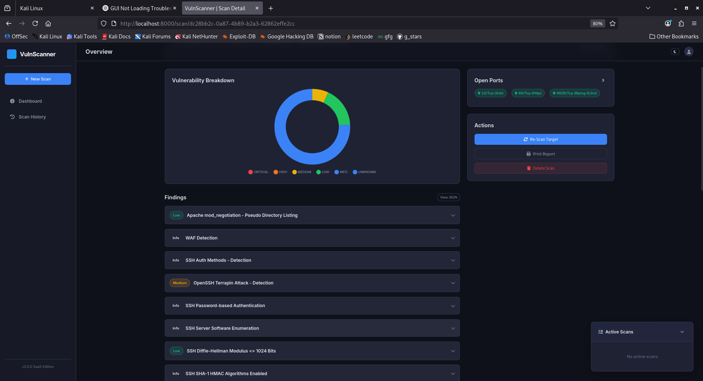
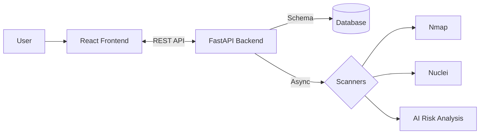
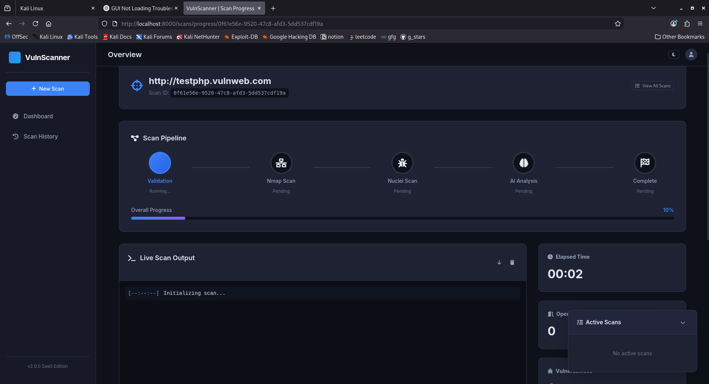
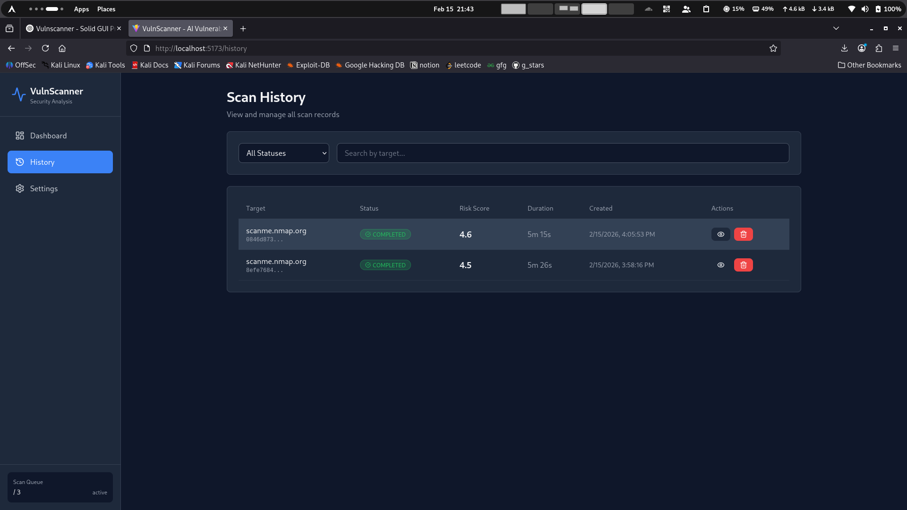

# 🛡️ XenoraSec - Advanced Vulnerability Scanner

A professional, production-ready AI-powered vulnerability scanner with a modern web interface. Combines **FastAPI** backend with **React + Vite** frontend.

[](https://www.python.org/downloads/)
[](https://fastapi.tiangolo.com/)
[](https://reactjs.org/)
[](https://www.typescriptlang.org/)
[](https://github.com/prithvi-01x/XenoraSec)

<p align="center">
  
</p>

---

##  Overview

XenoraSec orchestrates **Nmap** and **Nuclei** for comprehensive security scanning, using AI risk analysis to provide intelligent scoring.

### 🛠️ Tech Stack
- **Backend**: FastAPI, SQLAlchemy (Async), Pydantic, Uvicorn
- **Frontend**: React, TypeScript, Vite, Tailwind CSS, TanStack Query
- **Security Tools**: Nmap, Nuclei
- **Database**: SQLite (Dev) / PostgreSQL (Prod)

### 🏗️ Architecture


---

## 📸 Screenshots

### Dashboard - Scan Progress
<p align="center">
  
</p>

### Scan History
<p align="center">
  
</p>

---

## ✨ Key Features

- **🛡️ Security Scanning**: Nmap & Nuclei integration with AI risk scoring
- **🖥️ Modern Dashboard**: Real-time progress, interactive charts, dark mode
- **⚙️ Reliability**: Async-first design, rate limiting, health checks
- **🔒 Security**: Input validation, CORS protection, private IP blocking

---

## 🚀 Quick Start

**Prerequisites**: Python 3.10+, Node.js 18+, Nmap, Nuclei.

```bash
# 1. Clone & Setup
git clone https://github.com/prithvi-01x/XenoraSec.git
cd xenorasec
python3 -m venv venv && source venv/bin/activate
pip install -r requirements.txt

# 2. Setup Frontend
cd frontend && npm install && cd ..

# 3. Configure
cp .env.example .env

# 4. Run
# Terminal 1: Backend
uvicorn app.main:app --host 0.0.0.0 --port 8000 --reload
# Terminal 2: Frontend
cd frontend && npm run dev
```

Visit **http://localhost:5173** to start scanning.
Detailed guide: **[QUICKSTART.md](QUICKSTART.md)**.

---

## 📚 Documentation & API

- **API Docs**: [http://localhost:8000/docs](http://localhost:8000/docs)
- **Architecture**: **[Architecture.md](Architecture.md)** (Design & Deployment)
- **Testing**: **[TESTING_GUIDE.md](TESTING_GUIDE.md)**
- **Changelog**: **[changelog.md](changelog.md)**

---

## 📁 Project Structure

```
xenorasec/
├── app/                  # FastAPI Backend
├── frontend/             # React Frontend
├── Screenshots/          # Images
├── docs/                 # Documentation
├── .env.example          # Config template
├── requirements.txt      # Python deps
└── README.md             # This file
```

---

## 🤝 Contributing & License

Contributions are welcome! Please fork and submit a PR.
This project is licensed under the **MIT License**.

**Built with ❤️ for security professionals**