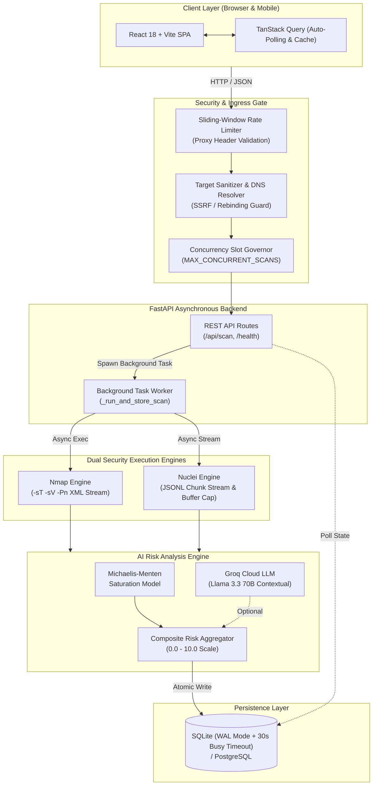

# 🛡️ XenoraSec - Advanced Vulnerability Scanner

> **Next-Generation Autonomous Security Assessment & Threat Surface Discovery Engine**

[](https://opensource.org/licenses/MIT)
[](https://www.python.org/downloads/)
[](https://fastapi.tiangolo.com/)
[](https://reactjs.org/)
[](https://www.typescriptlang.org/)
[](https://tailwindcss.com/)
[](https://www.docker.com/)
[](https://groq.com/)
[](https://github.com/prithvi-01x/XenoraSec)

<p align="center">
  
</p>

---

## 📑 Table of Contents

- [Overview](#-overview)
- [Key Features](#-key-features)
- [Architecture & Workflow](#-architecture)
- [Dual-Engine Scanning](#-dual-engine-scanning)
- [AI Risk Scoring Model](#-ai-risk-scoring-model)
- [Security & Defensive Safeguards](#-security--defensive-safeguards)
- [Database Architecture](#-database-architecture)
- [REST API Reference](#-rest-api-reference)
- [Environment Configuration](#-environment-configuration)
- [Installation & Quick Start](#-quick-start)
- [Production Deployment](#-production-deployment)
- [Frontend Tour & Mobile UX](#-frontend-tour--mobile-ux)
- [Testing & Quality Assurance](#-testing--quality-assurance)
- [Troubleshooting & FAQ](#-troubleshooting--faq)
- [Security Policy & Contributing](#-contributing--license)

---

## 🔍 Overview

**XenoraSec** is an enterprise-grade, open-source vulnerability scanning and attack surface management platform designed for security engineers, penetration testers, and DevSecOps teams. It unites industry-standard recon and vulnerability detection tools into an automated, highly concurrent, asynchronous workflow accompanied by a responsive cyber-defense dashboard.

Traditional security scanners either overwhelm security teams with disconnected raw CLI outputs or trap them behind monolithic, slow, blocking web frameworks. XenoraSec solves this by introducing:

1. **Non-Blocking Dual-Engine Orchestration**: Executes network-layer recon (**Nmap**) and template-driven vulnerability assessments (**Nuclei**) concurrently via non-blocking asyncio subprocesses with real-time stream processing.
2. **Hybrid Risk Intelligence**: Fuses a deterministic **Michaelis-Menten saturation model** (ensuring mathematically bounded, reproducible risk prioritization) with optional real-time **Groq Cloud LLM** contextual analysis.
3. **Zero-Trust Input & Network Defense**: Native safeguards against SSRF, loopback bypasses, DNS rebinding, reverse proxy header spoofing, and rogue scans.
4. **Reliable SQLite WAL / Postgres Concurrency**: Engineered for heavy polling and multi-scan execution without database lockups or zombie process leakage.

### 🏗️ Architecture & Pipeline

```mermaid
flowchart TB
    subgraph Client ["Client Layer (Browser & Mobile)"]
        UI["React 18 + Vite SPA"]
        TQ["TanStack Query (Auto-Polling & Cache)"]
        UI <--> TQ
    end

    subgraph SecurityGate ["Security & Ingress Gate"]
        RL["Sliding-Window Rate Limiter\n(Proxy Header Validation)"]
        VAL["Target Sanitizer & DNS Resolver\n(SSRF / Rebinding Guard)"]
        SEM["Concurrency Slot Governor\n(MAX_CONCURRENT_SCANS)"]
    end

    subgraph Core ["FastAPI Asynchronous Backend"]
        ROUTER["REST API Routes\n(/api/scan, /health)"]
        TASK["Background Task Worker\n(_run_and_store_scan)"]
    end

    subgraph Engines ["Dual Security Execution Engines"]
        NMAP["Nmap Engine\n(-sT -sV -Pn XML Stream)"]
        NUCLEI["Nuclei Engine\n(JSONL Chunk Stream & Buffer Cap)"]
    end

    subgraph Analysis ["AI Risk Analysis Engine"]
        HEUR["Michaelis-Menten\nSaturation Model"]
        GROQ["Groq Cloud LLM\n(Llama 3.3 70B Contextual)"]
        AGG["Composite Risk Aggregator\n(0.0 - 10.0 Scale)"]
    end

    subgraph Database ["Persistence Layer"]
        DB[("SQLite (WAL Mode + 30s Busy Timeout)\n/ PostgreSQL")]
    end

    Client -->|HTTP / JSON| RL
    RL --> VAL
    VAL --> SEM
    SEM --> ROUTER
    ROUTER -->|Spawn Background Task| TASK
    TASK -->|Async Exec| NMAP
    TASK -->|Async Stream| NUCLEI
    NMAP --> Analysis
    NUCLEI --> Analysis
    HEUR --> AGG
    GROQ -.->|Optional| AGG
    AGG -->|Atomic Write| DB
    ROUTER -.->|Poll State| DB
```

#### Scan Request Lifecycle
```text
[User Submits Target]
        │
        ▼
[Proxy Header Check] ────(Spoofed / Rate Exceeded)───► [HTTP 429 Error]
        │
        ▼
[DNS Resolution & SSRF Guard] ──(Private / Loopback)──► [HTTP 400 Rejected]
        │
        ▼
[Queue Slot Acquisition] ───────(Slots Exhausted)────► [HTTP 503 Busy]
        │
        ▼
[Scan ID Generated & Record Created (Status: Running)]
        │
        ├──────────────────────┬──────────────────────┐
        ▼                                             ▼
 [Nmap Process (-sV)]                      [Nuclei Process (-jsonl)]
        │                                             │
   (XML Output)                              (Streaming Buffer)
        │                                             │
        └──────────────────────┬──────────────────────┘
                               │
                               ▼
               [Composite Risk Scoring Engine]
                 ├─ Michaelis-Menten Heuristic
                 └─ Optional Groq LLM Context
                               │
                               ▼
               [Persist to SQLite WAL / PostgreSQL]
                               │
                               ▼
               [Status: Completed / Partial]
```

---

## ⚙️ Dual-Engine Scanning Mechanics

XenoraSec integrates two premier security tools through asynchronous streaming wrappers designed for resilience and memory efficiency:

### 1. Nmap Network & Service Recon Engine
- **Non-Root Execution**: Runs unprivileged `-sT` (TCP Connect) scans, enabling safe execution inside unprivileged containers and cloud environments without raw socket capabilities.
- **Service Version Detection**: Appends `-sV` and `--open` to pinpoint running application versions and discard closed/filtered ports.
- **Dynamic Timing Profiles**: Employs `-T4` for standard remote scans and dynamically accelerates to `-T5` when scanning permitted local endpoints.
- **Fault-Tolerant XML Parser**: Reads structured XML (`-oX -`) directly from stdout. If a scan is forcibly truncated, the custom XML parser reconstructs broken closing tags (`</host>`, `</nmaprun>`) to extract partial port information instead of discarding the entire run.
- **Subprocess Cancellation Safety**: Subprocess handles are strictly tracked. If an HTTP request is aborted or an `asyncio.CancelledError` is raised, `process.kill()` executes instantly, avoiding zombie processes.

### 2. Nuclei Vulnerability & Misconfiguration Engine
- **Streaming JSONL Ingestion**: Executes Nuclei with `-jsonl -silent -no-interactsh`, streaming findings line-by-line rather than loading gigabytes of output into memory.
- **Adaptive Memory Ring-Buffer**: If the incoming stdout stream exceeds `MAX_BUFFER_SIZE` (1MB), the buffer automatically halves oldest data while retaining active line boundaries.
- **Vulnerability Safety Cap**: Configurable limit (`MAX_VULNERABILITIES = 1000`) prevents Denial-of-Service attacks from honeypots or wildcard DNS servers returning infinite findings.
- **Partial Health Classification**: If JSON decode errors exceed 20% of total lines emitted, the scan is flagged as `PARTIAL` rather than `FAILED`, preserving valid CVE and CWE discoveries.

## 📸 Screenshots

### Dashboard - Scan Progress
<p align="center">
  
</p>

### Scan History
<p align="center">
  
</p>

---

## ✨ Key Features

- **🛡️ Security Scanning**: Nmap & Nuclei integration with AI risk scoring
- **🖥️ Modern Dashboard**: Real-time progress, interactive charts, dark mode
- **⚙️ Reliability**: Async-first design, rate limiting, health checks
- **🔒 Security**: Input validation, CORS protection and also private IP blocking

---

## 🚀 Quick Start

**Prerequisites**: Python 3.10+, Node.js 18+, Nmap, Nuclei.

```bash
# 1. Clone & Setup
git clone https://github.com/prithvi-01x/XenoraSec.git
cd xenorasec
python3 -m venv venv && source venv/bin/activate
pip install -r requirements.txt

# 2. Setup Frontend
cd frontend && npm install && cd ..

# 3. Configure
cp .env.example .env

# 4. Run
# Terminal 1: Backend
uvicorn app.main:app --host 0.0.0.0 --port 8000 --reload
# Terminal 2: Frontend
cd frontend && npm run dev
```

Visit **http://localhost:5173** to start scanning.
Detailed guide: **[QUICKSTART.md](QUICKSTART.md)**.

---

## 📚 Documentation & API

- **API Docs**: [http://localhost:8000/docs](http://localhost:8000/docs)
- **Architecture**: **[Architecture.md](Architecture.md)** (Design & Deployment)
- **Testing**: **[TESTING_GUIDE.md](TESTING_GUIDE.md)**
- **Changelog**: **[changelog.md](changelog.md)**

---

## 📁 Project Structure

```
xenorasec/
├── app/                  # FastAPI Backend
├── frontend/             # React Frontend
├── Screenshots/          # Images
├── docs/                 # Documentation
├── .env.example          # Config template
├── requirements.txt      # Python deps
└── README.md             # This file
```

---

## 🤝 Contributing & License

Contributions are welcome! Please fork and submit a PR.
This project is licensed under the **MIT License**.

**Built with ❤️ for security professionals**